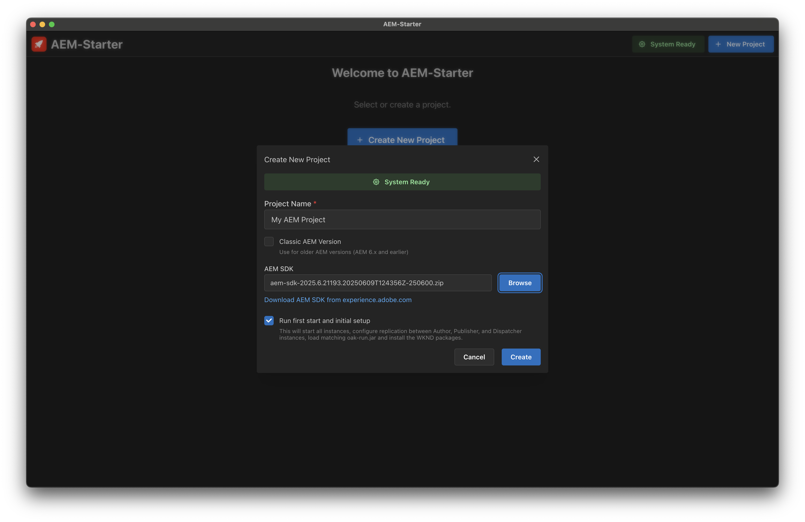
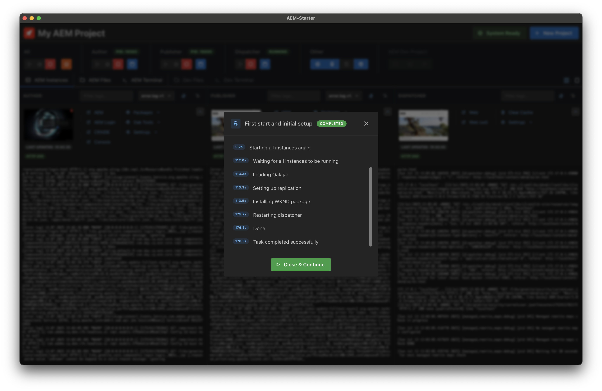
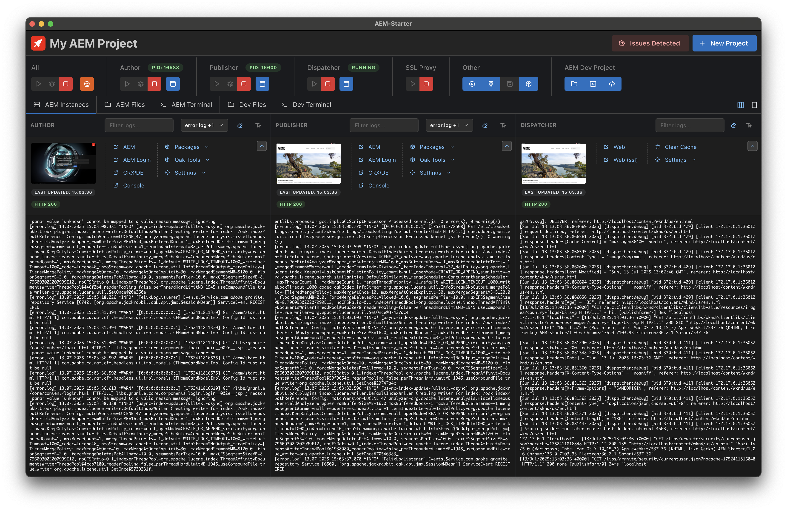

# AEM-Starter

AEM-Starter is a comprehensive desktop application designed to streamline the setup and management of local AEM-SDK environments. It provides developers with an intuitive interface to handle all aspects of AEM development workflows.

## Features

- **Setup of local AEM-SDK environments** with Author, Publisher and Dispatcher
- **Automated start, debug and stop** of AEM instances
- **Log tailing** for real-time monitoring and debugging
- **Automated replication setup** between Author, Publisher and Dispatcher
- **Package installation** (WKND, ACS-AEM-Commons, custom packages)
- **Backup and restore** functionality for environment management
- **Connection to AEM development project** for quick access to configurations, code and build tasks

## Requirements

- This app currently only runs on Apple Silicon Macs. Please reach out if you want to help with supporting other environments!
- AEM-SDK (Available for Adobe AEM customers at https://experience.adobe.com -> Software Distribution -> AEM as Cloud Service)
- Oracle JDK (Availalbe for Adobe AEM customers at https://experience.adobe.com -> Software Distribution -> General)
- Docker

## Installation

**[Download the latest release](https://github.com/dfoerderreuther/aemstarter/releases/latest)**

### Option A: Download DMG
1. Go to the latest release page and download the `.dmg` file
2. Open the DMG file
3. Drag AEM-Starter to your Applications folder
4. Launch AEM-Starter from Applications

### Option B: Download ZIP Archive
1. Go to the latest release page and download the `.zip` file
2. Extract the ZIP file
3. Move the extracted AEM-Starter app to your Applications folder
4. Launch AEM-Starter from Applications

## How to start

### Initial Setup

Open AEM-Starter from your applications and click "Create Project". 

Enter a project name and select the Cloud SDK. The top bar shows whether system requirements are fulfilled.

Click "Create" and select an empty folder for your installation. 

This initial start and setup will take several minutes. During this time, the system will: 
- Extract the Cloud SDK ZIP
- Extract the quickstart.jar into Author and Publisher instances
- Set up Dispatcher Docker
- Start Author, Publisher, and Dispatcher
- Load oak-run.jar matching your AEM version
- Set up Author to Publisher replication, Publisher invalidation, and Dispatcher invalidation request rights
- Install WKND on Author and Publisher

The system is now up and running and ready for exploration. AEM login credentials are the SDK default (admin/admin).

## Next steps

### Backup

It's probably a good idea to create your first backup, either by shutting down the instances and using the "Backup & Restore" function or by using the Automation Task "Create backup and start". 

### Settings

The Settings allow you to: 
- Enable or disable health checks. Disabling them can be useful during debugging or when following specific logs
- Configure Author, Publisher, or Dispatcher settings
- Connect your development project and choose your preferred editor

### Automation

A key feature of AEM-Starter is the ability to quickly restore and restart from a backup. This is often necessary when developing functionality that requires a specific content scenario (e.g., a fresh translation project, content before rollout, or a specific workflow state). 

There are several tasks to create backups or restore and run/debug from the first or last backup. Create uncompressed backups for faster performance.

### AEM Files / Dev Files

This is a simple file management view. The purpose of this function is to provide quick access for reading or making minor changes. AEM-Starter is not intended as a full code editor.

### AEM Terminal / Dev Terminal

Terminal application that starts in your specific project folder. The left column contains common commands that might be useful. Clicking a command only writes it to the prompt; you must execute it manually.

AEM-Starter Logging lets you follow the logs of this application, which might be useful if something goes wrong.

## Thank you for using AEM-Starter

This is a holiday project with the goal of creating a GUI for my AEM shell scripts. I hope it's useful! Please reach out if you want to contribute (Windows support?) or have ideas for new functionality. 