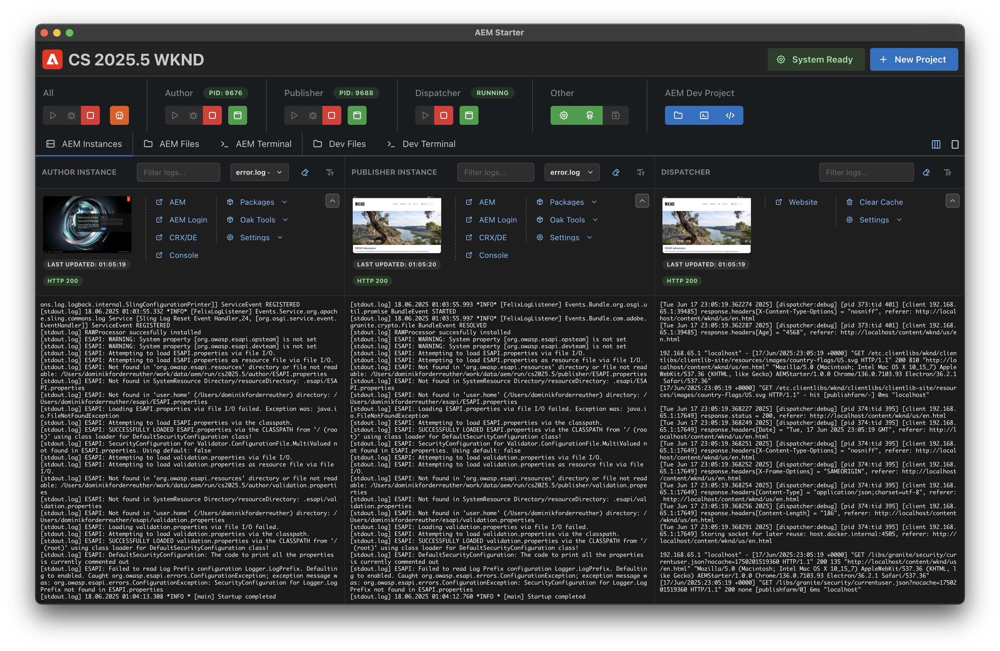

# AEM-Starter

AEM-Starter is a comprehensive desktop application designed to streamline the setup and management of local AEM-SDK environments. It provides developers with an intuitive interface to handle all aspects of AEM development workflows.

## Features

- **Setup of local AEM-SDK environments** with Author, Publisher and Dispatcher
- **Automated start, debug and stop** of AEM instances
- **Log tailing** for real-time monitoring and debugging
- **Automated replication setup** between Author, Publisher and Dispatcher
- **Package installation** (WKND, ACS-AEM-Commons, custom packages)
- **Backup and restore** functionality for environment management
- **Connection to AEM development project** for quick access to configurations, code and build tasks

## Requirements

- This app currently only runs on Apple Silicon Macs. Please reach out if you want to help with supporting other environments!
- Access to https://experience.adobe.com and download permission for AEM-SDK 

## Installation

**[Download the latest release](https://github.com/dfoerderreuther/aemstarter/releases/latest)**

### Option A: Download DMG
1. Go to the latest release page and download the `.dmg` file
2. Open the DMG file
3. Drag AEM-Starter to your Applications folder
4. Launch AEM-Starter from Applications

### Option B: Download ZIP Archive
1. Go to the latest release page and download the `.zip` file
2. Extract the ZIP file
3. Move the extracted AEM-Starter app to your Applications folder
4. Launch AEM-Starter from Applications

